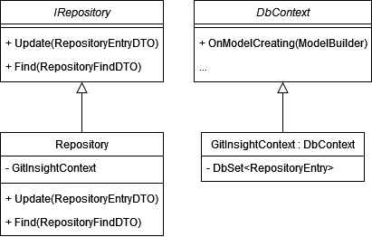

# Simple UML diagram
>

# Control flow of querying whether or not a repo exists in the database
1. A client class or component sends a request to the Repository class to find a commit in the database.
2. The Repository class initialized a GitInsightContext class - this class opens connection to the database, and ensure it's been created.
3. The Repository class queries the database for the requested commit and retrieves the data if it exists.
4. If the requested commit exists in the database, the Repository class returns the commit data to the client class or component.
5. If the requested commit does not exist in the database, the Repository class returns a null value to the client class or component.

# Control flow of updating/saving data to the database
1. A client class or component sends a request to the Repository class to update or create a new entry in the database (both happen through `.Update()`).
2. The Repository class initialized a GitInsightContext class - this class opens connection to the database, and ensure it's been created.
3. The Repository class saves the changes to the database and returns a response indicating whether the entry was updated or created.